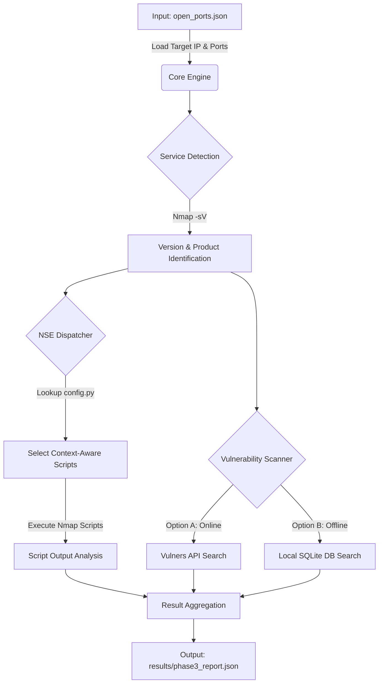

## Port Scanner — 통합 네트워크 스캔 프레임워크


### 📌 개요 (Overview)

이 프로젝트는 네트워크 자산에 대한 **3단계 계층적 스캔 파이프라인**을 제공합니다.

| 단계 | 이름 | 목적 |
|------|------|------|
| Phase 1 | 포트 Discovery | Nmap으로 지정 포트 그룹의 개방 여부 파악 |
| Phase 2 | 서비스 버전 탐지 | 개방된 TCP/UDP 포트에 대한 정밀 버전 스캔 |
| Deep Scan | 정책 추론 | Scapy raw 패킷으로 필터/차단 포트의 방화벽 정책 추론 |
| Phase 3 | 심화 분석 | NSE 스크립트 실행 + NVD/로컬 DB CVE 매핑 |

---

### ✨ 주요 기능 (Features)

- **프로필 기반 스캔**: `ext_discovery`, `int_discovery`, `discovery_1k` 등 용도별 프로필 지원
- **TCP + UDP 동시 스캔**: `-sSU` 조합으로 단일 Nmap 실행
- **2-Pass 스캔**: 1차(빠른 발견) → 2차(정밀 버전 탐지) 자동 연속 실행
- **방화벽 정책 추론**: Scapy ACK/SYN-ACK/reserved-bits 테스트로 DROP/DPI/명시적 거부 구분
- **Context-Aware NSE**: 탐지된 서비스에 맞는 NSE 스크립트만 선별 실행
- **하이브리드 CVE 검색**: NVD REST API(온라인) + 로컬 SQLite DB(오프라인) 자동 전환
- **병렬 처리**: ThreadPoolExecutor 기반 포트별 동시 분석
- **구조화된 JSON 리포트**: 각 단계 결과를 JSON으로 저장

---

### 📁 디렉토리 구조 (Project Structure)

```
port-scanner/
├── full_scan.py                          # 통합 진입점
│
├── Service_Scanner_Phase1_2/             # Phase 1+2+DeepScan
│   ├── config/
│   │   ├── profiles.yaml                 # 스캔 프로필 정의
│   │   ├── port_groups.yaml              # 포트 그룹 정의
│   │   ├── profiles_loader.py            # Phase 1/2 진입점
│   │   └── port_groups_loader.py         # 포트 목록 빌더
│   ├── core/
│   │   ├── nmap_runner.py                # Nmap 실행 + 결과 처리
│   │   ├── nmap_parser.py                # XML → JSON 파서
│   │   ├── nmap_report.py                # Phase1+2 병합 리포트
│   │   └── orchestrator.py              # 레거시 CLI (미사용)
│   ├── deep_scan/
│   │   ├── bridge.py                     # DeepScan 진입점
│   │   └── core/
│   │       ├── scapy_engine.py           # Scapy 패킷 테스트 엔진
│   │       └── logic.py                  # 방화벽 정책 추론 로직
│   └── runs/                             # 스캔 결과 저장
│
└── Service_Scanner_Phase3/               # Phase 3
    ├── main_phase3.py                    # Phase 3 진입점
    ├── config.py                         # 설정 (직접 생성 필요)
    ├── core/
    │   ├── engine.py                     # 병렬 스캔 엔진
    │   └── dispatcher.py                 # NSE 스크립트 선정
    ├── cve/
    │   └── scanner.py                    # NVD API + 로컬 DB CVE 검색
    ├── utils/
    │   ├── logger.py                     # 로깅 설정
    │   ├── parser.py                     # Nmap 출력 파싱/정리
    │   └── cve_lookup.py                 # SQLite CVE 조회 유틸
    ├── data/                             # nvd_vuln.db (자동 생성)
    ├── results/                          # Phase 3 리포트
    └── logs/                             # 실행 로그
```


---

### 📋 요구사항 (Requirements)

### 시스템
- Python **3.8+** (zoneinfo 내장 모듈 필요)
- **Nmap** 설치 및 PATH 등록
- **루트/관리자 권한** (raw socket: nmap -sS, Scapy)

**Python 패키지**
```bash
pip install pyyaml python-nmap scapy requests
# 선택: Vulners API 사용 시
pip install vulners

```

---

### 🛠️ 설치 (Installation)

**1. 저장소 클론**
git clone https://github.com/suhyeon514/port-scanner.git
cd port-scanner

**2. 의존성 설치**
pip install pyyaml python-nmap scapy requests

**3. Phase 3 설정 파일 생성 (필수 — 저장소에 포함되지 않음)**

저장소에는 보안 상의 이유로 `config.py` 파일이 포함되어 있지 않습니다. 프로젝트를 실행하려면 `Service_Scanner_Phase3` 디렉토리 내에 직접 `config.py` 파일을 생성해야 합니다. 

> **⚠️ 보안 주의 (Security Warning):** > 실제 API 키를 코드에 하드코딩한 채로 Git에 푸시하지 마세요. `config.py`는 이미 `.gitignore`에 등록되어 있어야 합니다. 안전한 관리를 위해 환경 변수(`os.getenv`) 사용을 권장합니다.

아래의 템플릿을 복사하여 `config.py`를 생성해 주세요.


```python
# Service_Scanner_Phase3/config.py
import os

# --- [시스템 설정] ---
MAX_WORKERS = 4  # 동시에 분석할 포트(스레드) 개수
TIMEOUT = 350    # 각 포트별 최대 스캔 시간 (초)

# --- [Nmap 스캔 인자 설정] ---
NMAP_STABLE_ARGS = "-Pn -T3 --max-retries 3 --open"
NMAP_SCRIPT_TIMEOUT = 180
NMAP_VERSION_SCAN_ARGS = "-sV --version-all"

# --- [API 키 설정 (보안 주의)] ---
# 환경변수를 사용하거나, 발급받은 실제 키 문자열을 입력하세요.
VULNERS_API_KEY = os.getenv("VULNERS_API_KEY", "") # "YOUR_VULNERS_API_KEY"
NVD_API_KEY = os.getenv("NVD_API_KEY", "")         # "YOUR_NVD_API_KEY"

# --- [Local NVD 설정] ---
# API 실패 시 사용할 로컬 NVD 데이터 폴더 경로
NVD_DATA_DIR = os.path.join(os.getcwd(), "data")

# --- [NSE 스크립트 매핑 테이블] (핵심 스캔 전략) ---
# 서비스명(Key)에 따라 실행할 타겟 맞춤형 NSE 스크립트(Value)를 지정합니다.
NSE_MAPPING = {
    # Web Service
    'http': 'http-title,http-headers,http-methods,http-server-header,http-enum',
    'https': 'ssl-cert,http-title,http-headers,http-methods,http-enum',
    'http-alt': 'http-title,http-headers,http-methods',
    'ssl/http': 'ssl-cert,http-title,http-headers',

    # Infrastructure
    'ssh': 'ssh2-enum-algos,ssh-hostkey,ssh-auth-methods',
    'ftp': 'ftp-anon,ftp-syst,ftp-vsftpd-backdoor',
    'telnet': 'telnet-encryption,telnet-ntlm-info',
    'rdp': 'rdp-enum-encryption,rdp-ntlm-info',
    
    # Database
    'mysql': 'mysql-info,mysql-empty-password,mysql-users,mysql-variables',
    'postgresql': 'pgsql-info,pgsql-version',
    'mssql': 'ms-sql-info,ms-sql-config,ms-sql-dump-hashes',
    'mongodb': 'mongodb-info,mongodb-databases',
    'redis': 'redis-info',
    
    # Mail & DNS
    'smtp': 'smtp-commands,smtp-open-relay,smtp-enum-users',
    'domain': 'dns-service-discovery,dns-recursion,dns-nsid',

    # RPC, NFS, Samba
    'rpcbind': 'rpcinfo', 
    'nfs': 'nfs-showmount,nfs-ls', 
    'netbios-ssn': 'smb-os-discovery,smb-enum-shares,smb-enum-users,smb-security-mode',
    'microsoft-ds': 'smb-os-discovery,smb-enum-shares,smb-security-mode',

    # Backdoors & Remote Shells
    'bindshell': 'banner', 
    'java-rmi': 'rmi-dumpregistry', 
    'irc': 'irc-info,irc-unrealircd-backdoor',
    'irc-ssl': 'irc-info,irc-unrealircd-backdoor',

    # Legacy Unix & Special Ports
    'exec': 'rlogin-auth', 
    'login': 'rlogin-auth',
    'shell': 'rlogin-auth',
    'distccd': 'distcc-cve2004-2687',
    'vnc': 'vnc-info,vnc-title',
    'x11': 'x11-access',
    'ajp13': 'ajp-auth',
    'ipp': 'cups-info',
    'ppp': 'http-title,http-headers,http-methods,http-enum,banner',

    # Default (알 수 없는 서비스에 대한 적극적 탐색)
    'default': 'banner, safe' 
}
```

---

### 🚀 사용법 (Usage)
전체 파이프라인 실행 (권장)

**1. 기본 프로필(discovery_1k)로 실행**
    ```
    sudo python full_scan.py [스캔 대상 IP]
    ```

**2. 단계별 독립 실행**
    
    * 2-1. Phase 1/2 단독 실행
    
    ```bash
    cd Service_Scanner_Phase1_2
    sudo python -m config.profiles_loader --profile discovery_1k --targets 192.168.1.100
    # 2차 스캔 건너뛰기
    sudo python -m config.profiles_loader --profile discovery_1k --targets 192.168.1.100 --no-second-pass
    ```

    * 2-2. Phase 3 단독 실행
    ```bash
    cd Service_Scanner_Phase3
    sudo python main_phase3.py ../Service_Scanner_Phase1_2/runs/<timestamp>_discovery_1k_final_report.json
    ```

---

### ⚙️ 설정 옵션 (Configuration)
* 스캔 프로필 (Service_Scanner_Phase1_2/config/profiles.yaml)
```
    profiles:
    my_profile:
        target_defaults:
        tcp:
            include_groups: ["web", "db"]   # port_groups.yaml의 그룹 사용
            include_sets: ["tcp_1_1024"]     # 1-1024 전체 범위
            exclude_groups: []
        udp:
            include_groups: ["core_udp_internal"]
        nmap_policy:
        timing_profile: "balanced"   # fast(T4) | balanced(T3) | careful(T2)
        max_retries: 2
```

**포트 그룹 (Service_Scanner_Phase1_2/config/port_groups.yaml)**

    * 기본 제공 TCP 그룹: web, db, remote_admin, mail, infra, directory, monitoring
    * 기본 제공 UDP 그룹: core_udp_internal, vpn_udp
    * 기본 제공 TCP 세트: tcp_1_1024 (포트 1~1024 전체)


**Phase 3 설정 (Service_Scanner_Phase3/config.py)**

| 변수 | 기본값 예시 | 설명 |
| :--- | :--- | :--- |
| `MAX_WORKERS` | `5` | 병렬 스캔 스레드 수 |
| `TIMEOUT` | `120` | Nmap 스캔 타임아웃(초) |
| `NMAP_VERSION_SCAN_ARGS` | `"-sV --version-intensity 9"` | 버전 탐지 Nmap 인자 |
| `NMAP_SCRIPT_TIMEOUT` | `30` | NSE 스크립트 타임아웃(초) |
| `NVD_API_KEY` | `""` | NVD API 키 (선택, 없어도 동작) |
| `VULNERS_API_KEY` | `""` | Vulners API 키 (현재 사용 안 함) |
| `NVD_DATA_DIR` | `"data"` | 로컬 SQLite DB 디렉토리 |
| `NSE_MAPPING` | `{서비스: 스크립트,...}` | 서비스별 NSE 스크립트 매핑 |

---


### 📊 출력 형식 (Output Format)

* Phase 1/2 최종 리포트 (runs/<timestamp>_<profile>_final_report.json)

    ```JSON
        {
            "meta": {
                "profile": "discovery_1k",
                "targets": ["192.168.1.100"],
                "timestamp": "2024-01-15T14-30-00+0900",
                "nmap_version": "7.94"
            },
            "hosts": [
                {
                "address": "192.168.1.100",
                "hostname": "victim.local",
                "status": "up",
                "ports": [
                    {
                    "proto": "tcp",
                    "port": 80,
                    "state": "open",
                    "phase1": {"state": "open", "reason": "syn-ack"},
                    "phase2": {"state": "open", "service": {"name": "http", "product": "Apache httpd", "version": "2.4.51"}}
                    }
                ]
                }
            ]
        }
    ```
* Deep Scan 결과 (runs/open_ports.json)

```JSON
    {
        "target_ip": "192.168.1.100",
        "inference_details": [
            {
            "port": 8080,
            "proto": "tcp",
            "nmap_state": "filtered",
            "inferred_policy": "심층 패킷 검증(DPI) 작동 중",
            "reasoning": "표준 패킷(0)은 허용하나, 비표준 예약 비트를 탐지하여 차단함."
            }
        ]
    }
```

* Phase 3 최종 리포트 (Service_Scanner_Phase3/results/phase3_report.json)

```JSON
    {
        "target_ip": "192.168.1.100",
        "total_scanned": 5,
        "scan_details": [
            {
            "port": 3306,
            "protocol": "tcp",
            "status": "success",
            "service": "mysql",
            "product": "MySQL",
            "version": "5.7.38",
            "cpe": "cpe:2.3:a:mysql:mysql:5.7.38",
            "scripts_output": {
                "mysql-info": "Protocol: 10, Version: 5.7.38...",
                "mysql-empty-password": "Account 'root' has no password!"
            },
            "vulnerabilities": [
                {
                "id": "CVE-2022-21417",
                "title": "Vulnerability in MySQL Server...",
                "cvss": 4.9,
                "severity": "MEDIUM",
                "href": "https://nvd.nist.gov/vuln/detail/CVE-2022-21417",
                "source": "nvd_api"
                }
            ],
            "nuclei_hint": {"target_url": "192.168.1.100:3306", "service": "mysql", "protocol": "tcp"},
            "duration": 12.34
            }
        ]
    }
```

---

### 🔧 문제 발생 시 

| 증상 | 원인 | 해결책 |
| :--- | :--- | :--- |
| `ModuleNotFoundError: Service_Scanner_Phase3.Service_Scanner_Phase3.config` | `config.py` 파일 없음 | 위 설치 섹션의 `config.py` 생성 단계 수행 |
| `nmap: command not found` | Nmap 미설치 | `apt install nmap` / `brew install nmap` |
| `Operation not permitted` (Scapy) | root 권한 필요 | `sudo` 로 실행 |
| Phase 3 결과 없음 (`No valid targets`) | Phase 1/2 결과에 state="open" 포트 없음 | Phase 1/2 실행 후 `final_report.json` 확인 |
| NVD API 매우 느림 | API 키 없을 때 6초 딜레이 | `NVD_API_KEY` 설정 (무료 발급) |
| 로컬 DB 검색 결과 없음 | `nvd_vuln.db` 없음 | NVD Data Feed JSON을 `data/` 폴더에 넣고 DB 빌드 |


---

# Service Scanner Phase 3 (Advanced Enumeration & Vulnerability Mapping)

**Service Scanner Phase 3**는 포트 스캔(Phase 1/2) 이후 단계에서 실행되는 **심화 분석 및 취약점 진단 프레임워크**입니다.

단순히 포트의 개방 여부를 확인하는 것을 넘어, 실행 중인 서비스의 **정확한 버전(CPE)**을 식별하고, 상황에 맞는 **NSE(Nmap Script Engine)**를 선별 실행하며, **CVE(Common Vulnerabilities and Exposures)** 정보를 매핑하여 보안 위협을 구체화합니다.

---

## 🔄 Workflow & Pipeline

이 프로젝트는 다음과 같은 순차적 파이프라인을 통해 동작합니다.



1.  **Input Loading**: 이전 단계에서 생성된 `open_ports.json`을 읽어 분석 대상을 설정합니다.
2.  **Version Detection**: Nmap의 `-sV` 옵션을 사용하여 서비스의 정밀한 버전(CPE)을 탐지합니다.
3.  **Context-Aware NSE Execution**:
    *   모든 스크립트를 무작위로 실행하지 않습니다.
    *   식별된 서비스(예: `mysql`, `ssh`)에 맞춰 `config.py`에 정의된 **최적의 스크립트만 선별**하여 실행합니다.
4.  **Hybrid Vulnerability Mapping**:
    *   **Online**: API Key가 존재하면 `Vulners API`를 통해 실시간 취약점 정보를 조회합니다.
    *   **Offline**: API가 없거나 실패 시, 로컬에 구축된 `nvd_vuln.db` (SQLite)에서 취약점을 검색합니다.
5.  **Reporting**: 수집된 모든 정보(버전, 스크립트 결과, CVE 목록)를 JSON 리포트로 저장합니다.

---

## 📂 Project Structure (Tree)

```text
Service_Scanner_Phase3/
├── config.py                # [설정] 스캔 옵션, API 키, NSE 매핑 테이블 정의
├── main_phase3.py           # [실행] 메인 엔트리 포인트 (스캔 시작)
├── test.py                  # [도구] 로컬 DB(nvd_vuln.db) 구축 및 검색 테스트 도구
├── open_ports.json          # [입력] 분석 대상 IP 및 포트 목록 (Phase 1/2 산출물)
│
├── core/                    # [코어] 스캔 엔진 핵심 로직
│   ├── engine.py            # 전체 스캔 파이프라인 제어 및 스레드 관리
│   └── dispatcher.py        # 서비스별 적절한 NSE 스크립트를 선정하는 로직
│
├── cve/                     # [취약점] CVE 분석 모듈
│   ├── scanner.py           # Vulners API 및 로컬 DB 하이브리드 스캐너 구현
│   └── __init__.py
│
├── utils/                   # [유틸] 보조 기능
│   ├── logger.py            # 로깅 설정 (콘솔 및 파일 출력)
│   ├── parser.py            # Nmap XML/Text 결과 파싱
│   └── cve_lookup.py        # CPE 문자열 파싱 및 유틸리티
│
├── data/                    # [데이터] 오프라인 분석용 데이터
│   ├── nvd_vuln.db          # (자동생성) NVD 데이터를 담은 SQLite DB
│   └── *.json               # (사용자 준비) NVD Data Feeds JSON 파일
│
├── results/                 # [결과] 최종 분석 리포트 저장소
└── logs/                    # [로그] 실행 로그 저장소
```

---

## 📝 Key Files Description

### 1. Root Directory
*   **`main_phase3.py`**: 프로그램의 메인 실행 파일입니다. 입력 파일(`open_ports.json`)을 로드하고, 로깅을 설정하며, `Phase3Engine`을 구동하여 전체 스캔 프로세스를 시작합니다.
*   **`config.py`**: 프로젝트 설정 파일입니다. NSE 스크립트 매핑(`NSE_MAPPING`), Vulners API 키, 스레드 수(`MAX_WORKERS`) 등 핵심 동작 옵션을 정의합니다.
*   **`test.py`**: 로컬 데이터베이스 관리 도구입니다. `data/` 폴더의 NVD JSON 파일들을 파싱하여 `nvd_vuln.db` (SQLite)를 생성하고, 검색 기능을 테스트할 수 있습니다.

### 2. Core Module (`core/`)
*   **`core/engine.py`**: 스캔 엔진의 핵심 로직을 담당합니다. 스레드 풀을 관리하여 병렬 처리를 수행하고, 각 포트별로 [서비스 탐지 -> 스크립트 실행 -> 취약점 분석]의 파이프라인을 제어합니다.
*   **`core/dispatcher.py`**: 서비스별 맞춤형 NSE 스크립트 선정 로직입니다. Nmap이 탐지한 서비스 명(예: `mysql`, `http`)을 기반으로 `config.py`를 참조하여 실행할 최적의 스크립트 목록을 반환합니다.

### 3. CVE Module (`cve/`)
*   **`cve/scanner.py`**: 취약점 스캔을 수행하는 모듈입니다. Vulners API(온라인)와 로컬 SQLite DB(오프라인)를 결합한 하이브리드 방식으로 동작하며, API 실패 시 로컬 DB로 자동 전환되는 Fail-over 로직이 구현되어 있습니다.

### 4. Utilities (`utils/`)
*   **`utils/logger.py`**: 로깅 시스템을 설정합니다. 콘솔 출력과 함께 `logs/` 폴더에 타임스탬프가 포함된 로그 파일을 생성하여 실행 기록을 남깁니다.
*   **`utils/parser.py`**: Nmap의 실행 결과(XML/Text)를 파싱하여 서비스 버전, 스크립트 출력 결과 등을 Python 객체로 변환하는 유틸리티입니다.
*   **`utils/cve_lookup.py`**: CPE(Common Platform Enumeration) 문자열을 처리하고, 로컬 DB(`nvd_vuln.db`)에서 제품 및 버전 정보를 기반으로 CVE를 검색하는 쿼리 함수들을 제공합니다.

---

## 🚀 Getting Started

### Prerequisites
*   Python 3.8+
*   **Nmap** 설치 필수 (시스템 PATH에 등록되어 있어야 함)

### Installation
필요한 Python 라이브러리를 설치합니다.

```bash
pip install python-nmap vulners requests
```

### Usage

#### Step 1: 입력 데이터 준비
프로젝트 루트에 `open_ports.json` 파일이 있어야 합니다.
```json
{
    "target_ip": "192.168.1.100",
    "open_ports": [
        { "port": 80, "protocol": "tcp" },
        { "port": 3306, "protocol": "tcp" }
    ]
}
```

#### Step 2: 스캐너 실행 (Main Scan)
```bash
python main_phase3.py
```
*   실행 결과는 `results/phase3_report.json`에 저장됩니다.
*   진행 상황은 `logs/` 폴더의 로그 파일에서 확인할 수 있습니다.

#### Step 3: (Optional) 로컬 DB 구축
오프라인 모드를 사용하려면 NVD Data Feeds(JSON)를 `data/` 폴더에 넣고 아래 명령어를 실행하여 DB를 빌드합니다.
```bash
python test.py
```

---

## 📊 Output Example

최종 결과물(`results/phase3_report.json`)은 다음과 같은 구조를 가집니다.

```json
{
    "target_ip": "192.168.116.141",
    "scan_details": [
        {
            "port": 3306,
            "protocol": "tcp",
            "service": "mysql",
            "product": "MySQL",
            "version": "5.5.23",
            "scripts_output": {
                "mysql-info": "Protocol: 10, Version: 5.5.23...",
                "mysql-empty-password": "Account 'root' has no password!"
            },
            "vulnerabilities": [
                {
                    "id": "CVE-2012-XXXX",
                    "title": "MySQL Vulnerability...",
                    "cvss": 7.5,
                    "href": "https://..."
                }
            ]
        }
    ]
}
```
