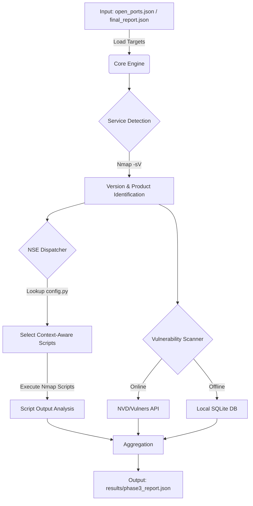

### 다단계 Service Port Scanner — 통합 네트워크 스캔 프레임워크

네트워크 자산을 대상으로 **발견(Discovery) → 정밀 식별(Version/NSE) → 정책 추론(Deep Scan) → 취약점 매핑(CVE)**까지 이어지는 **다단계 스캔 파이프라인**입니다.

---

### 1. 개요

이 프로젝트는 네트워크 자산에 대해 **3단계 계층적 스캔 파이프라인**을 제공합니다.

---

### 2. 파이프라인(Phase) 구성

| 단계 | 이름 | 목적 |
|------|------|------|
| Phase 1 | 포트 Discovery | Nmap으로 지정 포트 그룹의 개방 여부 파악 |
| Phase 2 | 서비스/버전 탐지 | 개방된 TCP/UDP 포트에 대한 정밀 버전 스캔 |
| Deep Scan | 정책 추론 | Scapy raw 패킷으로 필터/차단 포트의 방화벽 정책 추론 |
| Phase 3 | 심화 분석 | NSE 스크립트 실행 + NVD/로컬 DB 기반 CVE 매핑 |

> 참고: Phase 1/2 + Deep Scan은 `Service_Scanner_Phase1_2/`, Phase 3는 `Service_Scanner_Phase3/`에 분리되어 있습니다.

---

### 3. 주요 기능

- **프로필 기반 스캔**: `ext_discovery`, `int_discovery`, `discovery_1k` 등 용도별 프로필
- **TCP + UDP 동시 스캔**: `-sSU` 조합으로 단일 Nmap 실행
- **2-Pass 스캔**: 1차(빠른 발견) → 2차(정밀 버전 탐지) 자동 연속 실행
- **방화벽 정책 추론(Deep Scan)**: Scapy 기반 ACK/SYN-ACK/Reserved-bits 테스트로 DROP/DPI/명시적 거부 구분
- **Context-Aware NSE**: 탐지된 서비스에 맞는 NSE만 선별 실행
- **하이브리드 CVE 검색**: NVD REST API(온라인) + 로컬 SQLite DB(오프라인) 자동 전환
- **병렬 처리**: `ThreadPoolExecutor` 기반 포트별 동시 분석
- **구조화된 JSON 리포트**: 각 단계 결과를 JSON으로 저장

---

### 4. 디렉토리 구조

```text
port-scanner/
├── full_scan.py                          # 통합 실행 진입점(권장)
│
├── Service_Scanner_Phase1_2/             # Phase 1+2+DeepScan
│   ├── config/
│   │   ├── profiles.yaml                 # 스캔 프로필 정의
│   │   ├── port_groups.yaml              # 포트 그룹 정의
│   │   ├── profiles_loader.py            # Phase 1/2 진입점
│   │   └── port_groups_loader.py         # 포트 목록 빌더
│   ├── core/
│   │   ├── nmap_runner.py                # Nmap 실행 + 결과 처리
│   │   ├── nmap_parser.py                # XML → JSON 파서
│   │   ├── nmap_report.py                # Phase1+2 병합 리포트
│   │   └── orchestrator.py               # 레거시 CLI (미사용)
│   ├── deep_scan/
│   │   ├── bridge.py                     # DeepScan 진입점
│   │   └── core/
│   │       ├── scapy_engine.py           # Scapy 패킷 테스트 엔진
│   │       └── logic.py                  # 방화벽 정책 추론 로직
│   └── runs/                             # Phase 1/2 결과 저장
│
└── Service_Scanner_Phase3/               # Phase 3
    ├── main_phase3.py                    # Phase 3 실행 진입점
    ├── config.py                         # 설정 (직접 생성 필요, 저장소 미포함)
    ├── core/
    │   ├── engine.py                     # 병렬 스캔 엔진
    │   └── dispatcher.py                 # NSE 스크립트 선정
    ├── cve/
    │   └── scanner.py                    # NVD API + 로컬 DB CVE 검색
    ├── utils/
    │   ├── logger.py                     # 로깅 설정
    │   ├── parser.py                     # Nmap 출력 파싱/정리
    │   └── cve_lookup.py                 # SQLite CVE 조회 유틸
    ├── data/                             # nvd_vuln.db (자동 생성)
    ├── results/                          # Phase 3 리포트
    └── logs/                             # 실행 로그
```

---

### 5. 요구사항

### 시스템
- Python **3.8+** (zoneinfo 내장 모듈 필요)
- **Nmap** 설치 및 PATH 등록
- **루트/관리자 권한** 필요할 수 있음
  - raw socket 사용하는 스캔(nmap `-sS`, Scapy) 등

### Python 패키지
```bash
pip install pyyaml python-nmap scapy requests
# (선택) Vulners API 사용 시
pip install vulners
```

---

### 6. 설치

```bash
git clone https://github.com/suhyeon514/port-scanner.git
cd port-scanner

pip install pyyaml python-nmap scapy requests
```

---

### 7. 빠른 시작(권장)

### 전체 파이프라인 실행
```bash
sudo python full_scan.py [스캔 대상 IP]
```

예)
```bash
sudo python full_scan.py 192.168.1.100
```

---

### 8. 단계별 실행

### 8.1 Phase 1/2 단독 실행
```bash
cd Service_Scanner_Phase1_2

sudo python -m config.profiles_loader --profile discovery_1k --targets 192.168.1.100

# 2차 스캔(정밀 버전 탐지) 건너뛰기
sudo python -m config.profiles_loader --profile discovery_1k --targets 192.168.1.100 --no-second-pass
```

### 8.2 Phase 3 단독 실행
> Phase 3는 **Phase 1/2 산출물(final_report.json)** 을 입력으로 사용합니다.

```bash
cd Service_Scanner_Phase3
sudo python main_phase3.py ../Service_Scanner_Phase1_2/runs/<timestamp>_discovery_1k_final_report.json
```

---

### 9. 설정(Configuration)

### 9.1 Phase 1/2 프로필 설정
파일: `Service_Scanner_Phase1_2/config/profiles.yaml`

예시:
```yaml
profiles:
  my_profile:
    target_defaults:
    tcp:
      include_groups: ["web", "db"]
      include_sets: ["tcp_1_1024"]
      exclude_groups: []
    udp:
      include_groups: ["core_udp_internal"]
    nmap_policy:
      timing_profile: "balanced"   # fast(T4) | balanced(T3) | careful(T2)
      max_retries: 2
```

### 9.2 포트 그룹 설정
파일: `Service_Scanner_Phase1_2/config/port_groups.yaml`

- 기본 제공 TCP 그룹: `web`, `db`, `remote_admin`, `mail`, `infra`, `directory`, `monitoring`
- 기본 제공 UDP 그룹: `core_udp_internal`, `vpn_udp`
- 기본 제공 TCP 세트: `tcp_1_1024` (1~1024 전체)

### 9.3 Phase 3 설정 파일 생성(필수)
보안 상의 이유로 `Service_Scanner_Phase3/config.py`는 저장소에 포함되지 않습니다. 직접 생성해야 합니다.

> **보안 주의:** 실제 API 키를 코드에 하드코딩한 채로 Git에 푸시하지 마세요.  
> 환경변수(`NVD_API_KEY`, `VULNERS_API_KEY`) 사용을 권장합니다.

아래 템플릿으로 생성하세요:

```python
# Service_Scanner_Phase3/config.py
import os

# --- [시스템 설정] ---
MAX_WORKERS = 4
TIMEOUT = 350

# --- [Nmap 스캔 인자 설정] ---
NMAP_STABLE_ARGS = "-Pn -T3 --max-retries 3 --open"
NMAP_SCRIPT_TIMEOUT = 180
NMAP_VERSION_SCAN_ARGS = "-sV --version-all"

# --- [API 키 설정] ---
VULNERS_API_KEY = os.getenv("VULNERS_API_KEY", "")
NVD_API_KEY = os.getenv("NVD_API_KEY", "")

# --- [Local NVD 설정] ---
NVD_DATA_DIR = os.path.join(os.getcwd(), "data")

# --- [NSE 스크립트 매핑 테이블] ---
NSE_MAPPING = {
    # Web Service
    'http': 'http-title,http-headers,http-methods,http-server-header,http-enum',
    'https': 'ssl-cert,http-title,http-headers,http-methods,http-enum',
    'http-alt': 'http-title,http-headers,http-methods',
    'ssl/http': 'ssl-cert,http-title,http-headers',

    # Infrastructure
    'ssh': 'ssh2-enum-algos,ssh-hostkey,ssh-auth-methods',
    'ftp': 'ftp-anon,ftp-syst,ftp-vsftpd-backdoor',
    'telnet': 'telnet-encryption,telnet-ntlm-info',
    'rdp': 'rdp-enum-encryption,rdp-ntlm-info',

    # Database
    'mysql': 'mysql-info,mysql-empty-password,mysql-users,mysql-variables',
    'postgresql': 'pgsql-info,pgsql-version',
    'mssql': 'ms-sql-info,ms-sql-config,ms-sql-dump-hashes',
    'mongodb': 'mongodb-info,mongodb-databases',
    'redis': 'redis-info',

    # Mail & DNS
    'smtp': 'smtp-commands,smtp-open-relay,smtp-enum-users',
    'domain': 'dns-service-discovery,dns-recursion,dns-nsid',

    # RPC, NFS, Samba
    'rpcbind': 'rpcinfo',
    'nfs': 'nfs-showmount,nfs-ls',
    'netbios-ssn': 'smb-os-discovery,smb-enum-shares,smb-enum-users,smb-security-mode',
    'microsoft-ds': 'smb-os-discovery,smb-enum-shares,smb-security-mode',

    # Backdoors & Remote Shells
    'bindshell': 'banner',
    'java-rmi': 'rmi-dumpregistry',
    'irc': 'irc-info,irc-unrealircd-backdoor',
    'irc-ssl': 'irc-info,irc-unrealircd-backdoor',

    # Legacy Unix & Special Ports
    'exec': 'rlogin-auth',
    'login': 'rlogin-auth',
    'shell': 'rlogin-auth',
    'distccd': 'distcc-cve2004-2687',
    'vnc': 'vnc-info,vnc-title',
    'x11': 'x11-access',
    'ajp13': 'ajp-auth',
    'ipp': 'cups-info',
    'ppp': 'http-title,http-headers,http-methods,http-enum,banner',

    # Default
    'default': 'banner, safe'
}
```

---

### 10. 출력 형식(Output)

### 10.1 Phase 1/2 최종 리포트
경로 예: `Service_Scanner_Phase1_2/runs/<timestamp>_<profile>_final_report.json`

예시:
```json
{
  "meta": {
    "profile": "discovery_1k",
    "targets": ["192.168.1.100"],
    "timestamp": "2024-01-15T14-30-00+0900",
    "nmap_version": "7.94"
  },
  "hosts": [
    {
      "address": "192.168.1.100",
      "hostname": "victim.local",
      "status": "up",
      "ports": [
        {
          "proto": "tcp",
          "port": 80,
          "state": "open",
          "phase1": {"state": "open", "reason": "syn-ack"},
          "phase2": {
            "state": "open",
            "service": {"name": "http", "product": "Apache httpd", "version": "2.4.51"}
          }
        }
      ]
    }
  ]
}
```

### 10.2 Deep Scan 결과
경로 예: `Service_Scanner_Phase1_2/runs/open_ports.json`

예시:
```json
{
  "target_ip": "192.168.1.100",
  "inference_details": [
    {
      "port": 8080,
      "proto": "tcp",
      "nmap_state": "filtered",
      "inferred_policy": "심층 패킷 검증(DPI) 작동 중",
      "reasoning": "표준 패킷(0)은 허용하나, 비표준 예약 비트를 탐지하여 차단함."
    }
  ]
}
```

### 10.3 Phase 3 최종 리포트
경로: `Service_Scanner_Phase3/results/phase3_report.json`

예시:
```json
{
  "target_ip": "192.168.1.100",
  "total_scanned": 5,
  "scan_details": [
    {
      "port": 3306,
      "protocol": "tcp",
      "status": "success",
      "service": "mysql",
      "product": "MySQL",
      "version": "5.7.38",
      "cpe": "cpe:2.3:a:mysql:mysql:5.7.38",
      "scripts_output": {
        "mysql-info": "Protocol: 10, Version: 5.7.38...",
        "mysql-empty-password": "Account 'root' has no password!"
      },
      "vulnerabilities": [
        {
          "id": "CVE-2022-21417",
          "title": "Vulnerability in MySQL Server...",
          "cvss": 4.9,
          "severity": "MEDIUM",
          "href": "https://nvd.nist.gov/vuln/detail/CVE-2022-21417",
          "source": "nvd_api"
        }
      ],
      "nuclei_hint": {"target_url": "192.168.1.100:3306", "service": "mysql", "protocol": "tcp"},
      "duration": 12.34
    }
  ]
}
```

---

### 11. 문제 해결(Troubleshooting)

| 증상 | 원인 | 해결책 |
|---|---|---|
| `ModuleNotFoundError: Service_Scanner_Phase3...config` | `config.py` 파일 없음 | [9.3](#93-phase-3-설정-파일-생성필수)의 템플릿으로 `Service_Scanner_Phase3/config.py` 생성 |
| `nmap: command not found` | Nmap 미설치 | `apt install nmap` / `brew install nmap` |
| `Operation not permitted` (Scapy) | root 권한 필요 | `sudo`로 실행 |
| Phase 3 결과 없음 (`No valid targets`) | Phase 1/2 결과에 `open` 포트가 없음 | Phase 1/2 리포트에서 open 포트 유무 확인 |
| NVD API가 느림 | API 키 없을 때 지연 발생 가능 | `NVD_API_KEY` 설정(무료 발급) |
| 로컬 DB 검색 결과 없음 | `nvd_vuln.db` 없음 | `data/`에 NVD Data Feed JSON 준비 후 DB 빌드 |

---

### 12. 보안 주의사항
- **실제 API 키를 Git에 커밋/푸시하지 마세요.**
- Phase 3의 키는 **환경변수**로 주입하는 방식을 권장합니다.
  - `export NVD_API_KEY="..."`
  - `export VULNERS_API_KEY="..."`

---

### (부록) Phase 3 Workflow (Advanced Enumeration & Vulnerability Mapping)


