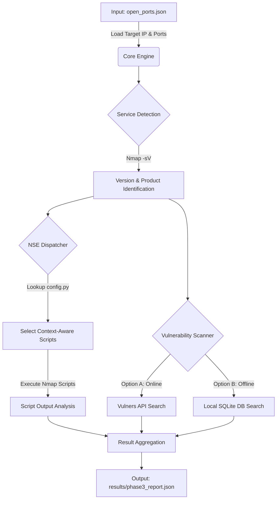

# Service Scanner Phase 3 (Advanced Enumeration & Vulnerability Mapping)

**Service Scanner Phase 3**는 포트 스캔(Phase 1/2) 이후 단계에서 실행되는 **심화 분석 및 취약점 진단 프레임워크**입니다.

단순히 포트의 개방 여부를 확인하는 것을 넘어, 실행 중인 서비스의 **정확한 버전(CPE)**을 식별하고, 상황에 맞는 **NSE(Nmap Script Engine)**를 선별 실행하며, **CVE(Common Vulnerabilities and Exposures)** 정보를 매핑하여 보안 위협을 구체화합니다.

---

## 🔄 Workflow & Pipeline

이 프로젝트는 다음과 같은 순차적 파이프라인을 통해 동작합니다.



1.  **Input Loading**: 이전 단계에서 생성된 `open_ports.json`을 읽어 분석 대상을 설정합니다.
2.  **Version Detection**: Nmap의 `-sV` 옵션을 사용하여 서비스의 정밀한 버전(CPE)을 탐지합니다.
3.  **Context-Aware NSE Execution**:
    *   모든 스크립트를 무작위로 실행하지 않습니다.
    *   식별된 서비스(예: `mysql`, `ssh`)에 맞춰 `config.py`에 정의된 **최적의 스크립트만 선별**하여 실행합니다.
4.  **Hybrid Vulnerability Mapping**:
    *   **Online**: API Key가 존재하면 `Vulners API`를 통해 실시간 취약점 정보를 조회합니다.
    *   **Offline**: API가 없거나 실패 시, 로컬에 구축된 `nvd_vuln.db` (SQLite)에서 취약점을 검색합니다.
5.  **Reporting**: 수집된 모든 정보(버전, 스크립트 결과, CVE 목록)를 JSON 리포트로 저장합니다.

---

## 📂 Project Structure (Tree)

```text
Service_Scanner_Phase3/
├── config.py                # [설정] 스캔 옵션, API 키, NSE 매핑 테이블 정의
├── main_phase3.py           # [실행] 메인 엔트리 포인트 (스캔 시작)
├── test.py                  # [도구] 로컬 DB(nvd_vuln.db) 구축 및 검색 테스트 도구
├── open_ports.json          # [입력] 분석 대상 IP 및 포트 목록 (Phase 1/2 산출물)
│
├── core/                    # [코어] 스캔 엔진 핵심 로직
│   ├── engine.py            # 전체 스캔 파이프라인 제어 및 스레드 관리
│   └── dispatcher.py        # 서비스별 적절한 NSE 스크립트를 선정하는 로직
│
├── cve/                     # [취약점] CVE 분석 모듈
│   ├── scanner.py           # Vulners API 및 로컬 DB 하이브리드 스캐너 구현
│   └── __init__.py
│
├── utils/                   # [유틸] 보조 기능
│   ├── logger.py            # 로깅 설정 (콘솔 및 파일 출력)
│   ├── parser.py            # Nmap XML/Text 결과 파싱
│   └── cve_lookup.py        # CPE 문자열 파싱 및 유틸리티
│
├── data/                    # [데이터] 오프라인 분석용 데이터
│   ├── nvd_vuln.db          # (자동생성) NVD 데이터를 담은 SQLite DB
│   └── *.json               # (사용자 준비) NVD Data Feeds JSON 파일
│
├── results/                 # [결과] 최종 분석 리포트 저장소
└── logs/                    # [로그] 실행 로그 저장소
```

---

## 📝 Key Files Description

### 1. Root Directory
*   **`main_phase3.py`**: 프로그램의 메인 실행 파일입니다. 입력 파일(`open_ports.json`)을 로드하고, 로깅을 설정하며, `Phase3Engine`을 구동하여 전체 스캔 프로세스를 시작합니다.
*   **`config.py`**: 프로젝트 설정 파일입니다. NSE 스크립트 매핑(`NSE_MAPPING`), Vulners API 키, 스레드 수(`MAX_WORKERS`) 등 핵심 동작 옵션을 정의합니다.
*   **`test.py`**: 로컬 데이터베이스 관리 도구입니다. `data/` 폴더의 NVD JSON 파일들을 파싱하여 `nvd_vuln.db` (SQLite)를 생성하고, 검색 기능을 테스트할 수 있습니다.

### 2. Core Module (`core/`)
*   **`core/engine.py`**: 스캔 엔진의 핵심 로직을 담당합니다. 스레드 풀을 관리하여 병렬 처리를 수행하고, 각 포트별로 [서비스 탐지 -> 스크립트 실행 -> 취약점 분석]의 파이프라인을 제어합니다.
*   **`core/dispatcher.py`**: 서비스별 맞춤형 NSE 스크립트 선정 로직입니다. Nmap이 탐지한 서비스 명(예: `mysql`, `http`)을 기반으로 `config.py`를 참조하여 실행할 최적의 스크립트 목록을 반환합니다.

### 3. CVE Module (`cve/`)
*   **`cve/scanner.py`**: 취약점 스캔을 수행하는 모듈입니다. Vulners API(온라인)와 로컬 SQLite DB(오프라인)를 결합한 하이브리드 방식으로 동작하며, API 실패 시 로컬 DB로 자동 전환되는 Fail-over 로직이 구현되어 있습니다.

### 4. Utilities (`utils/`)
*   **`utils/logger.py`**: 로깅 시스템을 설정합니다. 콘솔 출력과 함께 `logs/` 폴더에 타임스탬프가 포함된 로그 파일을 생성하여 실행 기록을 남깁니다.
*   **`utils/parser.py`**: Nmap의 실행 결과(XML/Text)를 파싱하여 서비스 버전, 스크립트 출력 결과 등을 Python 객체로 변환하는 유틸리티입니다.
*   **`utils/cve_lookup.py`**: CPE(Common Platform Enumeration) 문자열을 처리하고, 로컬 DB(`nvd_vuln.db`)에서 제품 및 버전 정보를 기반으로 CVE를 검색하는 쿼리 함수들을 제공합니다.

---

## 🚀 Getting Started

### Prerequisites
*   Python 3.8+
*   **Nmap** 설치 필수 (시스템 PATH에 등록되어 있어야 함)

### Installation
필요한 Python 라이브러리를 설치합니다.

```bash
pip install python-nmap vulners requests
```

### Usage

#### Step 1: 입력 데이터 준비
프로젝트 루트에 `open_ports.json` 파일이 있어야 합니다.
```json
{
    "target_ip": "192.168.1.100",
    "open_ports": [
        { "port": 80, "protocol": "tcp" },
        { "port": 3306, "protocol": "tcp" }
    ]
}
```

#### Step 2: 스캐너 실행 (Main Scan)
```bash
python main_phase3.py
```
*   실행 결과는 `results/phase3_report.json`에 저장됩니다.
*   진행 상황은 `logs/` 폴더의 로그 파일에서 확인할 수 있습니다.

#### Step 3: (Optional) 로컬 DB 구축
오프라인 모드를 사용하려면 NVD Data Feeds(JSON)를 `data/` 폴더에 넣고 아래 명령어를 실행하여 DB를 빌드합니다.
```bash
python test.py
```

---

## 📊 Output Example

최종 결과물(`results/phase3_report.json`)은 다음과 같은 구조를 가집니다.

```json
{
    "target_ip": "192.168.116.141",
    "scan_details": [
        {
            "port": 3306,
            "protocol": "tcp",
            "service": "mysql",
            "product": "MySQL",
            "version": "5.5.23",
            "scripts_output": {
                "mysql-info": "Protocol: 10, Version: 5.5.23...",
                "mysql-empty-password": "Account 'root' has no password!"
            },
            "vulnerabilities": [
                {
                    "id": "CVE-2012-XXXX",
                    "title": "MySQL Vulnerability...",
                    "cvss": 7.5,
                    "href": "https://..."
                }
            ]
        }
    ]
}
```